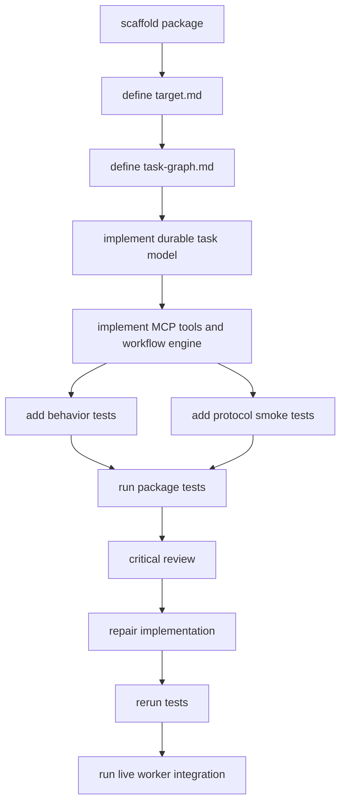

# Delegated Task MCP Task Graph

This graph defines the implementation and verification shape for `@narada2/delegated-task-mcp`.

## Graph



## Nodes

### A. scaffold package

Create package metadata, tsconfig, README, source directory, test directory, and root repo registration.

Acceptance:

- `packages/delegated-task-mcp/package.json` exists.
- `packages/delegated-task-mcp/tsconfig.json` exists.
- package is referenced by root `tsconfig.json`.
- root `package.json` has `test:delegated-task`.

### B. define target.md

Create the desired target shape of the surface.

Acceptance:

- `target.md` describes boundary, first-class objects, tools, and non-goals.
- The target distinguishes worker runs from delegated tasks.

### C. define task-graph.md

Create this graph and keep it aligned with implementation.

Acceptance:

- Graph is readable as explicit dependency data.
- Nodes map to implementation and verification work.

### D. implement durable task model

Implement task records with deterministic paths under a governed task root.

Acceptance:

- `delegatedTaskRun` creates a task record and event log.
- IDs are generated when omitted and stable when `idempotency_key` is reused.
- Invalid task roots outside allowed roots are rejected.

### E. implement MCP tools and workflow engine

Expose the tool set:

- `delegated_task_run`
- `delegated_task_policy_inspect`
- `delegated_task_validate`
- `delegated_task_status`
- `delegated_task_wait`
- `delegated_tasks_list`
- `delegated_task_result`
- `delegated_task_summary`
- `delegated_task_events`
- `delegated_task_cancel`

Acceptance:

- `tools/list` exposes exactly these tools.
- Schemas include objective, constraints, workflow, acceptance, result_policy, task_id, include_diagnostics, limit, offset, and reason where appropriate.
- Tool annotations are conservative.
- Workflow execution supports durable step states, dependency resolution, fan-out, join/gate/note steps, simple conditions, retries, worker status refresh, and result consolidation.
- Validation rejects invalid workflow graphs, unsupported conditions, policy violations, and malformed acceptance contracts before execution.
- Summary and compact result views preserve review ergonomics while exposing output refs for large evidence sections.
- Events expose counts by kind, summaries by step, and last meaningful events for active steps.

### F. add behavior tests

Test core state behavior directly and through JSON-RPC tool calls.

Acceptance:

- Run creates task files and event files.
- Status returns compact state.
- Result returns normalized handoff shape.
- Wait returns task-level completion state without requiring callers to poll worker runs.
- List rediscovers active and terminal delegated tasks.
- Acceptance evaluation covers required files, required tests/tools from evidence, and forbidden patterns.
- Events support limit/offset and step-level summaries.
- Cancel changes status, appends an event, and annotates running child worker refs with cancellation requests.
- Unknown/missing task failures are diagnostic.

### G. add protocol smoke tests

Test initialize and tools/list shape.

Acceptance:

- Server name is `delegated-task-mcp`.
- Tools are ordered and named as target.
- Required schema fields are asserted.
- Strict schema boundaries for constraints, acceptance, and result policy are asserted.

### H. run package tests

Run:

```powershell
pnpm test:delegated-task
```

Acceptance:

- TypeScript build succeeds.
- Behavior tests pass.
- Protocol smoke test passes.

### I. critical review

Review for boundary coherence, hidden shell/file mutation, schema looseness, durability, and test gaps.

Acceptance:

- Review findings are either fixed or recorded as explicit residuals.

### J. repair implementation

Apply fixes from critical review.

Acceptance:

- No known blocking review findings remain.

### K. rerun tests

Rerun package tests after repair.

Acceptance:

- `pnpm test:delegated-task` passes after final fixes.

### L. run live worker integration

Run a real worker through `worker-delegation-mcp`, not only an injected fake worker.

Acceptance:

- `pnpm test:delegated-task:live` passes.
- The live test creates a delegated task, launches a child worker run, records a real `run_id`, and satisfies review quorum acceptance.
- If the local worker runtime is unavailable, the live test exits with an explicit skip diagnostic rather than failing deterministic CI.

## Commit Boundary

Keep commits scoped by ownership:

- `worker-delegation-mcp` public export changes separately when possible.
- `delegated-task-mcp` package, docs, tests, package metadata, and root registration together.
- unrelated Graph Mail changes must not be mixed into delegated-task commits.

## Delegation Plan

Use `worker-delegation-mcp` for at least one implementation/review pass:

1. Write-capable worker implements nodes D-G against this task graph.
2. Read/command-capable reviewer worker reviews nodes D-G and reports residuals against `target.md` and this graph.
3. Main agent integrates, repairs, and owns the final acceptance decision.

The delegated task MCP itself should not pretend to hide that this first package implementation was orchestrated manually; the package target is the surface that will make such orchestration first-class later.
